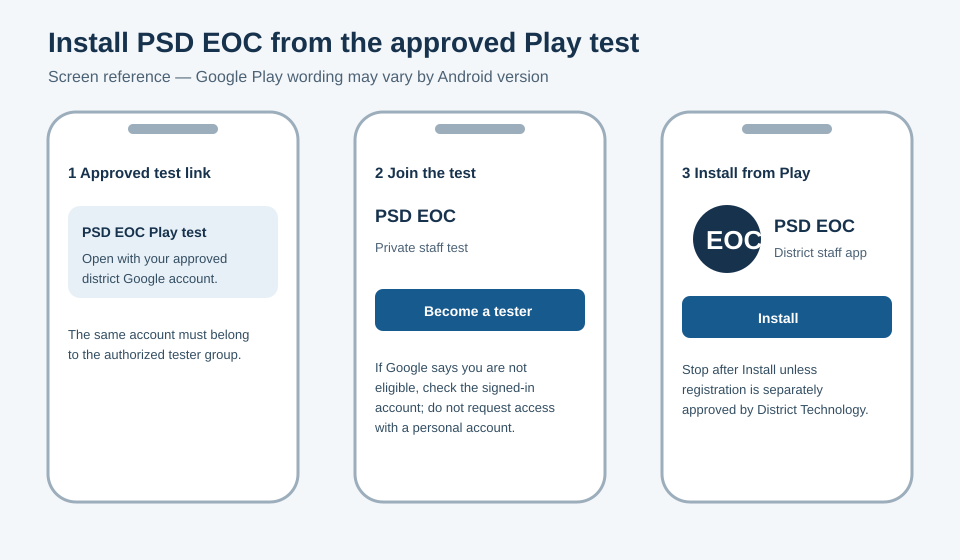
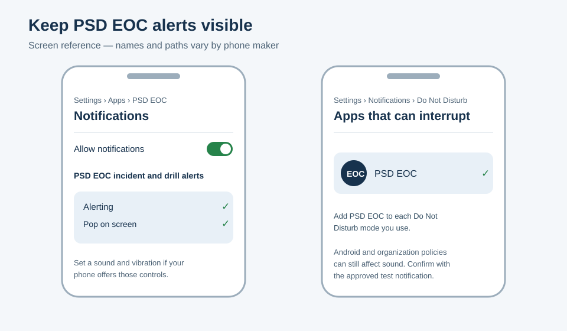

# Install PSD EOC on Android

> **Distribution status: BLOCKED.** No installable PSD EOC Play closed-test or
> Firebase build has been verified yet. These illustrated screen references are
> advance guidance, not provider screenshots or install proof. Do not try to
> install until District Technology announces availability.

PSD EOC is distributed privately to approved Peninsula School District staff
through a Google Play closed test. Firebase App Distribution is an interim
fallback only when District Technology explicitly directs you to it.
Installing the app does not start an incident, run a drill, or notify anyone.

> **Before you begin:** You need the approved closed-test link, the Google
> account that belongs to the district tester group, a secure screen lock, and
> internet access. Do not forward the link or use a personal Google account.

## Install from Google Play

1. Check the account shown in Google Play. Switch to the approved district
   Google account if needed.
2. Open the PSD EOC closed-test link sent through the approved district
   channel.
3. Confirm that the page says **PSD EOC** and identifies Peninsula School
   District. If it does not, stop and contact District Technology.
4. Tap **Become a tester**, then open the Google Play link and tap **Install**.
   Enrollment can take a few minutes to appear.
5. Open **PSD EOC** and sign in with your approved `@psd401.net` staff account.
6. Follow the app's prompt to enroll this device and enable fingerprint, face,
   or the device's secure unlock. PSD EOC does not create or store a separate
   PIN.

If Google Play says the item is unavailable or the account is not eligible,
check the signed-in Google account. Do not ask to add a personal account or
install an APK from email, chat, or an unofficial website.

## Allow the alert channel

On Android 13 or later, tap **Allow** when PSD EOC asks to send notifications.
Phone-maker wording varies. To check the settings manually:

1. Open **Settings → Apps → PSD EOC → Notifications**.
2. Turn on **Allow notifications**.
3. Open **PSD EOC incident and drill alerts**. This is the app's
   `eoc-alerts` channel.
4. Select **Alerting** and enable sound, vibration, lock-screen display, and
   **Pop on screen** or **Show as pop-up** when those controls are offered.
5. Do not lower this channel to Silent. Android keeps a user's channel choice
   across app updates.

The app requests Android's maximum channel importance, but Android and the
device owner remain in control. This setting cannot guarantee sound while the
phone is muted or restricted by device or organization policy.

## Check Do Not Disturb

1. Open **Settings → Notifications → Do Not Disturb**. Some phones place this
   under **Sound & vibration**.
2. Open **Apps**, **App notifications**, or **Apps that can interrupt**.
3. Add **PSD EOC** and allow its notifications.
4. Repeat this for any custom Modes or Routines you use.

## Verify the installation safely

Do not start an incident or drill just to test installation. Use only a
district-approved synthetic test window. Scheduling the window does not
authorize or trigger a send. At test time, an authenticated human must freshly
review the synthetic targets and consequence preview, obtain explicit
product-owner authorization, confirm the action, and launch the synthetic test:

- Open PSD EOC and confirm your expected staff name and authorized site list.
- Lock the device before the scheduled test.
- After the test, report whether the alert appeared, made a sound, and opened
  the correct **TEST ONLY** event. Provider acceptance or a visible push is not
  proof that every person received it.
- If no alert appears, leave the app installed and contact District Technology.
  Include the Android version, phone model, and PSD EOC version shown in App
  info. Do not send screenshots containing message content, staff identities,
  device tokens, or other recipient data through an unapproved channel.

## Interim Firebase installation

Use Firebase App Distribution only when District Technology sends an approved
invitation and explicitly says the Play closed test is unavailable. Confirm
the app name and package are `PSD EOC` and `net.psd401.eoc`. Android may warn
about installing a test build; never disable device security globally and
never install an APK received directly as an attachment. Return to the Play
closed test when District Technology announces that it is ready.

## Get help or remove access

Contact District Technology through the district's normal support channel if
you change devices, lose a device, leave the approved group, cannot unlock the
app, or see an unexpected site. They can revoke the old device session. Deleting
the app alone does not prove that the server-side session was revoked.
