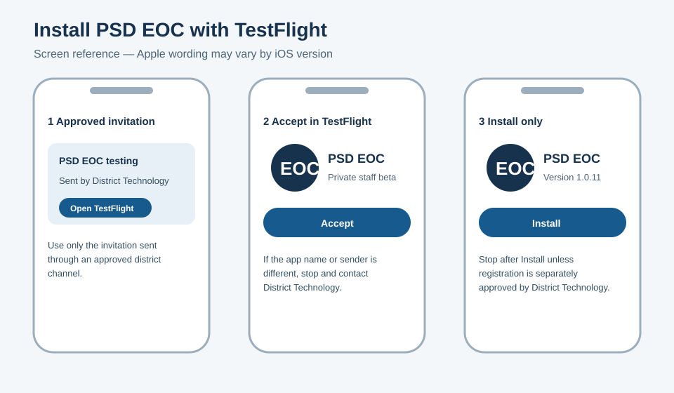
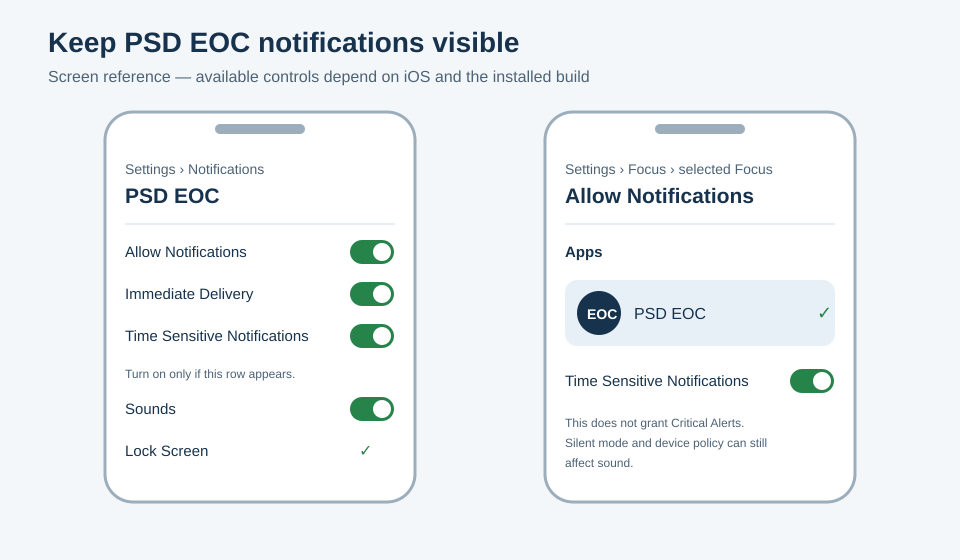

# Install PSD EOC on iPhone or iPad

> Current build and distribution state lives in the
> [operational readiness register](../INTEGRATIONS.md). These illustrated screen
> references are guidance, not provider screenshots or install proof. Install
> only when your district technology team supplies an approved invitation.

PSD EOC is distributed privately to approved district staff through Apple
TestFlight. Installing the app does not start an incident, run a drill, or
notify anyone.

> **Before you begin:** You need an approved TestFlight invitation from
> District Technology, your district staff sign-in, a device passcode, and
> internet access. Do not forward the invitation.
>
> An invitation authorizes installation only. Before you open PSD EOC, grant
> notification permission, or sign in, District Technology must separately
> confirm that this installation is included in the approved bounded synthetic
> staff-context push-registration verification. If it has not, stop after
> **Install** and do not open or sign in. Once separately authorized, opening
> and signing in with notification permission may obtain a push token, contact
> Expo, and register the device with PSD EOC. Registration does not send a
> notification, but it does change provider and server registration state.

## Install the app

1. Install **TestFlight** from Apple's App Store if it is not already on your
   device.
2. Open the PSD EOC invitation sent through the approved district channel.
3. Confirm that the invitation says **PSD EOC** and comes from your district's
   approved Apple account. If either is wrong, stop and contact District
   Technology.
4. Tap **View in TestFlight**, **Accept**, then **Install**. Apple's wording can
   vary slightly.
5. Only after District Technology gives the separate registration confirmation
   above, open **PSD EOC** and sign in with your approved district staff
   account. Otherwise stop after **Install**.
6. After that confirmation, follow the app's prompt to enroll this device and
   enable Face ID, Touch ID, or the device's secure unlock. PSD EOC does not
   create or store a separate PIN.

TestFlight builds expire. If TestFlight shows **Build Removed**, **Expired**, or
no Install button, do not use an old copy or another person's invitation.
Contact District Technology for the approved current build.

## Allow notifications

Only after the separate registration confirmation above, when PSD EOC asks to
send notifications, tap **Allow**. If you previously chose Don't Allow:

1. Open **Settings → Notifications → PSD EOC**.
2. Turn on **Allow Notifications**.
3. Choose **Immediate Delivery**, and enable **Lock Screen**, **Notification
   Center**, **Banners**, and **Sounds**.
4. If **Time Sensitive Notifications** appears, turn it on. If the row does not
   appear, the installed build has not exposed that feature; contact District
   Technology and do not assume Focus can be bypassed.

PSD EOC uses ordinary notification entitlement at launch. It does **not** have
Apple's Critical Alerts entitlement. Time Sensitive notifications can break
through some Focus settings when both the app and Focus allow them, but they do
not guarantee sound when the device is muted or restricted by device policy.

## Check Focus settings

Repeat these steps for every Focus you use, including Do Not Disturb and Sleep:

1. Open **Settings → Focus →** the Focus name.
2. Under **Allow Notifications**, open **Apps**.
3. Choose **Allow Notifications From**, tap **Add Apps**, and select **PSD
   EOC**.
4. If shown, turn on **Time Sensitive Notifications** for that Focus.

## Verify the installation safely

Do not start an incident or drill just to test installation. A push is **not
required** to prove installation. After the separate registration authorization
above, complete these no-notification-send checks:

1. Open PSD EOC, confirm district sign-in succeeds, and confirm the visible
   authorized site list is correct.
2. Close PSD EOC, lock the device, unlock it normally, and reopen the app.
   Confirm the app requires the expected Face ID, Touch ID, or device-secure
   unlock instead of asking for a PSD EOC PIN.
3. In TestFlight, record the PSD EOC version and build number. In PSD EOC, open
   **Release diagnostics** and record **Application version** and **Native build
   version**. Require **Identity available**, **Disabled — embedded store bundle
   only**, and **Embedded in this installed binary**. Both sources must match
   the exact version and build announced by District Technology. Stop if they
   differ or no approved identity was announced.
4. Recheck the notification and Focus settings above. Record pass/fail for the
   install, sign-in, authorized-site list, secure unlock, and settings. Do not
   include staff identities, message content, or device identifiers.

## Use event collaboration safely

- **Take Photo** asks for camera access only when you choose it. **Choose
  Existing Photo** uses the system photo picker without requesting broad photo
  library access. If camera access is denied, enable it in **Settings → PSD
  EOC → Camera**, or choose an existing photo instead.
- Describe a photo for screen-reader users before selecting it. The app keeps
  an interrupted draft privately on the device, validates image bytes, and the
  server strips EXIF and GPS metadata before the photo can appear. Never include
  student data.
- Correction and redaction controls appear only after the complete authorized
  timeline loads. A correction or redaction appends a linked entry; it never
  rewrites or deletes the original. If an action becomes unavailable, refresh
  the timeline and follow the plain-language recovery message.

## Optional separately authorized synthetic push check

Skip this section unless District Technology announces a separately approved
synthetic test window. Scheduling the window does not authorize or trigger a
send. At test time, an authenticated human must freshly review the synthetic
targets and consequence preview, obtain explicit product-owner authorization,
confirm the action, and launch the synthetic test:

- Lock the device before the scheduled test.
- Confirm the visible lock-screen notification title **and** body each carry the
  canonical **`[DRILL]`** transport marker. Open it and confirm the event screen
  visibly says **TEST — NOT A REAL INCIDENT**. Report whether the alert appeared, made a sound,
  and opened that exact drill. Provider acceptance or a visible push is not
  proof that every person received it.
- Stop immediately and contact District Technology if the notification shows
  **`[INCIDENT]`**, omits **`[DRILL]`**, has conflicting markers, uses
  real-incident wording, or uses only generic wording such as **TEST ONLY**.
  Also stop if the opened event does not visibly say **TEST — NOT A REAL INCIDENT**, says
  **REAL INCIDENT** or **DRILL — TRAINING ONLY**, or otherwise conflicts with the test notification. Do not
  continue testing an ambiguous real-versus-drill display.
- If no alert appears, leave the app installed and contact District Technology.
  Include your iOS version and PSD EOC build number from TestFlight. Do not send
  screenshots containing message content, staff identities, device tokens, or
  other recipient data through an unapproved channel.

## Get help or remove access

Contact District Technology through the district's normal support channel if
you change devices, lose a device, leave the approved group, cannot unlock the
app, or see an unexpected site. They can revoke the old device session. Deleting
the app alone does not prove that the server-side session was revoked.
